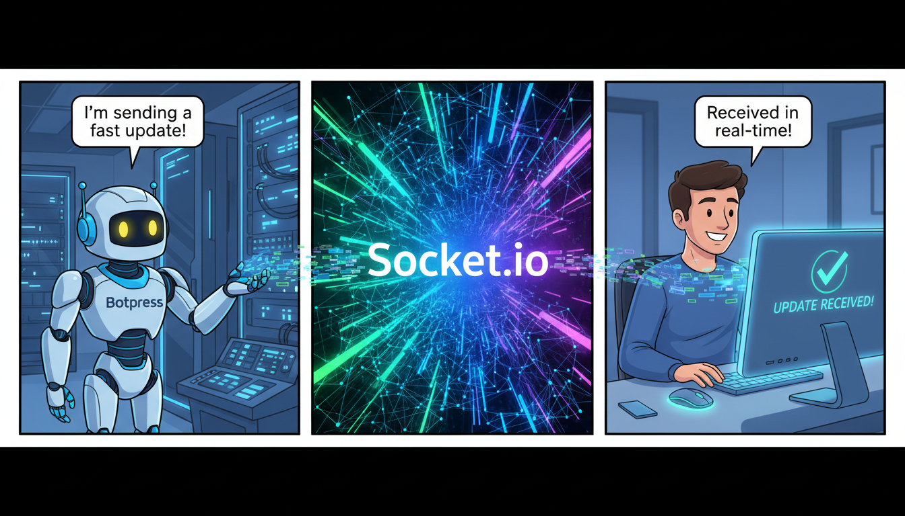

This is a professional and comprehensive `README.md` file tailored for your repository.

---

# botpress-socketio-backend-expressjs

[](https://glitch.com/edit/#!/import/github/your-username/botpress-socketio-backend-expressjs)


A lightweight, high-performance WebSocket server bridge designed to connect **Botpress** chatbots with custom web frontends. Built on top of **Express.js** and **Socket.io**, this server is optimized for deployment on [Glitch](https://glitch.com).

## 🚀 Overview

This repository provides a middleware backend that enables real-time, bidirectional communication between a Botpress instance and your client-side application. It handles the socket lifecycle, message broadcasting, and event emitting, allowing you to bypass the limitations of standard HTTP polling.

### Key Features
- **Real-time Communication:** Built on Socket.io for low-latency message delivery.
- **Botpress Ready:** Designed to work with Botpress Hooks and Actions.
- **Glitch Optimized:** Pre-configured for seamless hosting on Glitch.
- **CORS Enabled:** Easily configurable for cross-origin requests from your web app.
- **Event-Driven:** Emit custom events from Botpress to trigger UI changes on the client.

## 🛠️ Tech Stack
- **Engine:** [Node.js](https://nodejs.org/)
- **Web Framework:** [Express.js](https://expressjs.com/)
- **WebSocket Protocol:** [Socket.io](https://socket.io/)

## 📦 Installation

1. **Clone the repository:**
   ```bash
   git clone https://github.com/your-username/botpress-socketio-backend-expressjs.git
   cd botpress-socketio-backend-expressjs
   ```

2. **Install dependencies:**
   ```bash
   npm install
   ```

3. **Configure Environment Variables:**
   Create a `.env` file in the root directory:
   ```env
   PORT=3000
   CORS_ORIGIN=*
   ```

## 💻 Usage Example

### Server-Side (The Backend)
The server listens for messages from Botpress (via a POST request) and broadcasts them to the connected Socket.io clients.

```javascript
const express = require('express');
const http = require('http');
const { Server } = require('socket.io');

const app = express();
app.use(express.json());

const server = http.createServer(app);
const io = new Server(server, {
  cors: { origin: "*" }
});

// Endpoint for Botpress to send data to
app.post('/botpress-webhook', (req, res) => {
  const { userId, message, payload } = req.body;
  
  // Emit to specific room or all clients
  io.emit('bot_message', { userId, message, payload });
  
  res.status(200).send('Message Broadcasted');
});

io.on('connection', (socket) => {
  console.log('Client connected:', socket.id);
  
  socket.on('user_message', (data) => {
    // Handle messages coming from the frontend
    console.log('Message from user:', data);
  });
});

server.listen(process.env.PORT || 3000, () => {
  console.log('Socket server running...');
});
```

### Client-Side (The Web Frontend)
How to connect your web application to this server:

```javascript
import { io } from "socket.io-client";

const socket = io("https://your-project-name.glitch.me");

socket.on("connect", () => {
  console.log("Connected to WebSocket Server!");
});

socket.on("bot_message", (data) => {
  console.log("Bot says:", data.message);
  // Update your UI here
});
```

### Botpress Integration (Action/Hook)
In Botpress, use an `Execute Code` block to notify the socket server:

```javascript
const axios = require('axios')

const notifySocket = async () => {
  const payload = {
    userId: event.target,
    message: event.payload.text,
    payload: event.payload
  }
  
  await axios.post('https://your-project-name.glitch.me/botpress-webhook', payload)
}

return notifySocket()
```

## 🌐 Deployment on Glitch

1. Log in to [Glitch](https://glitch.com).
2. Click **New Project** -> **Import from GitHub**.
3. Paste the URL of this repository.
4. Glitch will automatically run `npm install` and `npm start`.
5. Your server will be live at `https://your-project-name.glitch.me`.

## 🔒 Security Recommendations
- **CORS:** In production, change `CORS_ORIGIN` from `*` to your specific domain.
- **Authentication:** Implement a token-based handshake (JWT) within the `io.on('connection')` middleware to ensure only authorized clients can connect.

## 📄 License
This project is licensed under the MIT License - see the [LICENSE](LICENSE) file for details.

---
*Maintained by [Your Name/Organization]*